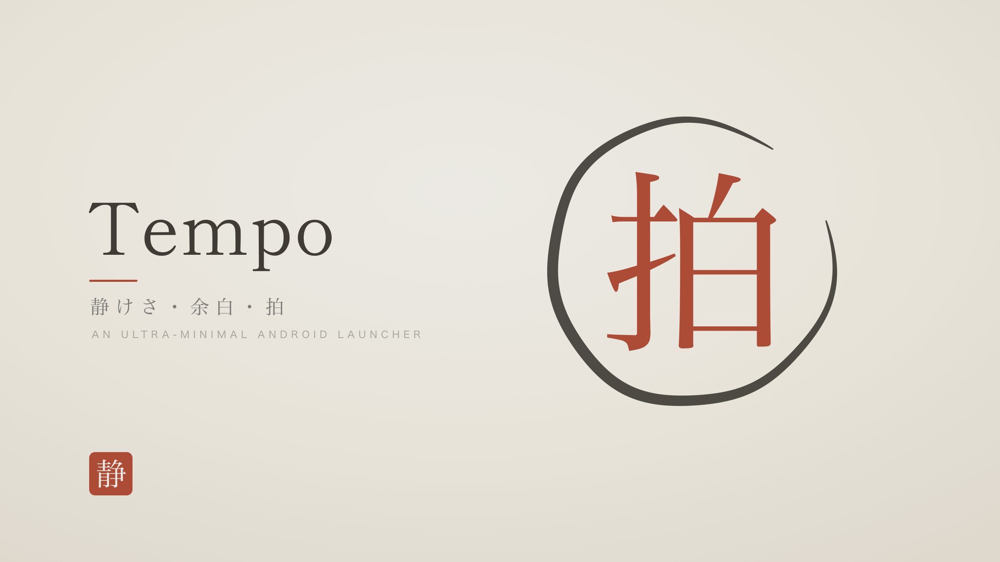
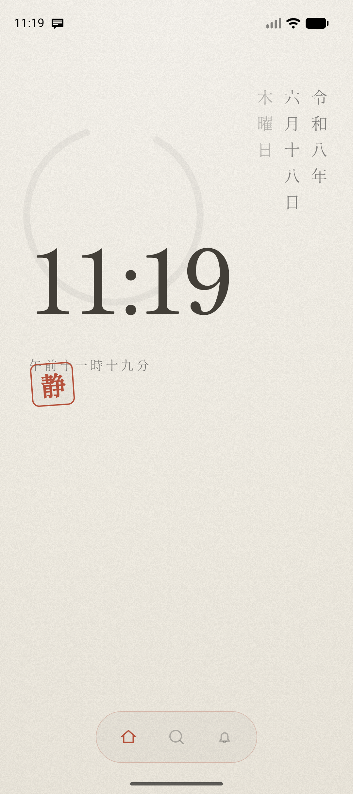
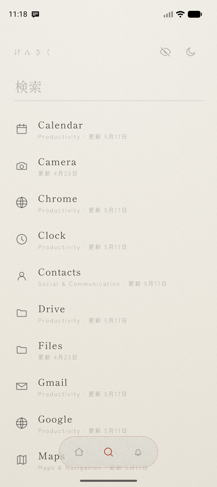
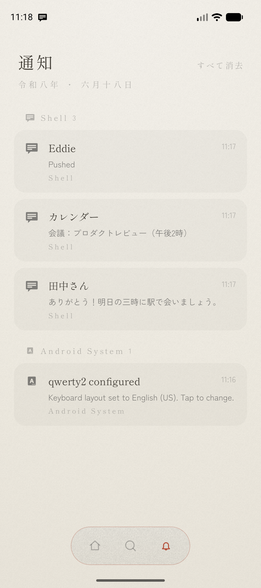

<div align="center">



# Tempo

**An ultra-minimal Android launcher: airy washi paper, Japanese typography, no distractions.**

[](LICENSE)
[](../../actions/workflows/android.yml)


### [⬇ Download the latest APK](https://github.com/eddiegulay/tempo/releases)

</div>

> **Why this exists**
>
> I doom-scroll. A lot. I went looking for a way out, and the best one I could come up with was to
> lock myself out, a launcher that blocks the apps for good. Not "hidden until I cave," not "back in
> a tap." For good. I mean it. And yes, the whole thing is in Japanese, a language I can't speak,
> because friction is the point.
>
> *eddiegulay*

Tempo is a home-screen replacement that does three quiet things well: tell the time, find an app,
and show your notifications, on a calm, paper-cream canvas with a single vermillion accent. It was
designed around one idea: **peace, no distractions.**

<div align="center">


&nbsp;&nbsp;

&nbsp;&nbsp;


<sub>Home (ホーム) &nbsp;·&nbsp; Search (検索) &nbsp;·&nbsp; Notifications (通知)</sub>

</div>

## Features

- **Home**: a faint sumi-e ensō behind a large mincho clock, the date in vertical Reiwa-era kanji
  (令和八年・六月十七日・水曜日), a live spoken-style reading (午後九時一分), and a single 静 ("stillness") seal.
- **Search (検索)**: live-filtered list of every installed app (work-profile apps included), with a
  scale-up launch animation and a long-press menu (app info / hide / uninstall). The theme toggle and
  the hidden-apps page live in this screen's header.
- **The blockade (the whole point)**: hide an app and it's gone for **10 days**, no take-backs. A
  confirmation spells out the commitment, a live countdown shows the time remaining, and while an app
  is blocked its **notifications are suppressed system-wide** too. The block is mirrored to shared
  storage, so uninstalling and reinstalling Tempo *doesn't* reset the timer.
- **Notifications (通知)**: your real notifications, tap to open, swipe to dismiss, ordered by the
  system ranking, minus anything from a blocked app.
- **Paper / Sumi themes**: a one-tap toggle between washi cream and warm charcoal, persisted.
- **A well-behaved launcher**: HOME-press always returns to a clean home, a lifecycle-aware
  minute clock (no idle wakeups), default-home onboarding, edge-to-edge insets, predictive back, and
  accessible controls.

## Usage

Tempo has three main screens, reached from the floating dock pill at the bottom of every screen.
There are no settings, widgets, folders, or app drawer. That's the point.

- **Set it as your home app.** Press Home and pick **Tempo**, or long-press the dock pill (it glows
  vermillion until Tempo is your default) to jump to the system picker.
- **Home (ホーム)**: a minute-aligned mincho clock with a spoken-style kanji reading, the date in
  vertical Reiwa-era kanji, the faint ensō, and the 静 seal. Back and the Home button always return
  here.
- **Search (検索)**: type any part of an app's name or package
  to live-filter. Tap a row (or press **Go** to launch the top hit) to open it; long-press for
  **app info / hide / uninstall**. The header carries the hidden-apps button and the theme toggle.
- **Block an app (the point).** Hide an app from the long-press menu or the hidden-apps page (the
  eye-off button in the Search header). You'll confirm a **10-day** commitment, granting shared-storage
  access so it survives a reinstall, and from then on the app is gone from Search and its
  notifications are suppressed. Tap it on the hidden-apps page to see the countdown; it can only be
  restored once the 10 days are up.
- **Notifications (通知)**: grant notification access once (tap **タップして許可**); then tap a row to
  open it or swipe either way to dismiss it.
- **Theme**: tap the sun/moon icon in the **Search header** to toggle **Paper ⇄ Sumi**; your
  choice is saved.

**→ Full walkthrough, gesture reference, and FAQ: [`docs/USER_GUIDE.md`](docs/USER_GUIDE.md).**

## Tech stack

- **Kotlin** + **Jetpack Compose** (Material 3): the entire UI is Compose, drawn edge-to-edge.
- **MVVM**: a single `LauncherViewModel` over three repositories (apps, theme, notifications).
- **Jetpack DataStore** for settings; **`LauncherApps`** for a live app inventory; a
  **`NotificationListenerService`** for real notifications (and for suppressing blocked apps').
- **The blockade ledger** lives in app-private storage *and* a mirror file in shared storage
  (All-files access on Android 11+, legacy shared storage on Android 10), reconciled by
  latest-`unlockAt`-wins so a reinstall can't shorten a block, with a monotonic clock guard against
  rolling the system time back.
- No DI framework, no third-party UI libraries, just AndroidX.

## Build & run

Requirements: **JDK 17+** and the **Android SDK** (compileSdk 36, minSdk 29 — Android 10 and up).

```bash
git clone https://github.com/eddiegulay/tempo.git
cd tempo
./gradlew assembleDebug          # build the debug APK
./gradlew installDebug           # build + install on a connected device/emulator
./gradlew testDebugUnitTest      # run unit tests
```

Open the project in Android Studio (latest stable) and let it sync; `local.properties` is generated
for you and is intentionally git-ignored.

### Using it as your launcher

Once installed, press Home and pick **Tempo**, then grant notification access when the 通知 screen
prompts you. App search needs no permission. See the [Usage](#usage) section above or the full
[User Guide](docs/USER_GUIDE.md) for the complete walkthrough.

## Project layout

```
app/src/main/java/io/eddiegulay/tempo/
├─ MainActivity.kt              # HOME activity; owns the ViewModel + lifecycle
├─ LauncherViewModel.kt         # single source of UI state
├─ data/                        # AppRepository, ThemeRepository (DataStore), BlockadeRepository, JapaneseDate
├─ notification/                # listener service (+ blocked-app suppression), store, repository
└─ ui/                          # Compose screens (Home/Search/Notifications/Filter), Dock, dialogs, theme
```

## Contributing

Contributions are welcome. Please read [`CONTRIBUTING.md`](CONTRIBUTING.md) and the
[Code of Conduct](CODE_OF_CONDUCT.md). Bug reports and feature requests go through the
[issue templates](.github/ISSUE_TEMPLATE).

## Credits

- The app logo is the kanji **拍** ("beat", a single-character reading of *tempo*) set in Hiragino
  Mincho, in the same vermillion as the home seal. The master asset is
  [`art/logo/tempo_logo.svg`](art/logo/tempo_logo.svg); the Android adaptive icon (vector foreground
  + washi gradient background + themed monochrome layer) is generated from the same glyph outline.
- The cover art ([`art/cover/tempo_cover.svg`](art/cover/tempo_cover.svg)) sets the same 拍 glyph inside a
  hand-drawn sumi-e ensō on the washi ground, with the 静 seal — the app's palette and type, composed
  around the negative space (*ma*) the launcher is built on.
- The visual direction was prototyped in **Claude Design** and implemented natively here.
- Display fonts: **Shippori Mincho** (clock, date, app names, 静 seal) and **Zen Kaku Gothic New**
  (notification copy, romaji), from Google Fonts under the SIL Open Font License, bundled under
  `app/src/main/res/font` so the design renders with its intended type rather than the platform
  Noto CJK fallback.

## License

[MIT](LICENSE) © 2026 Eddie Gulay
