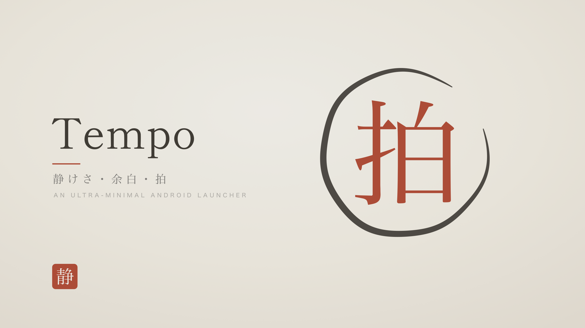
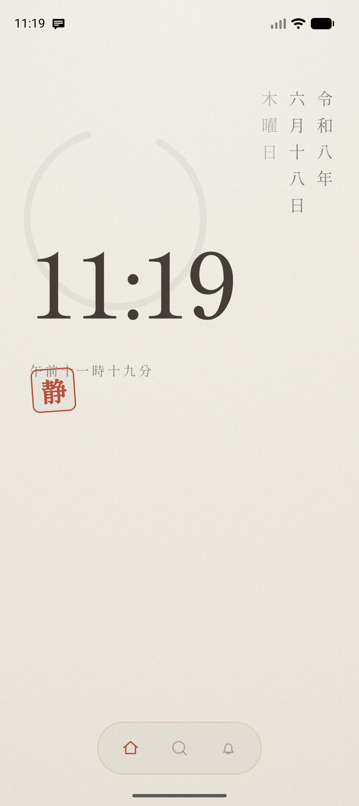
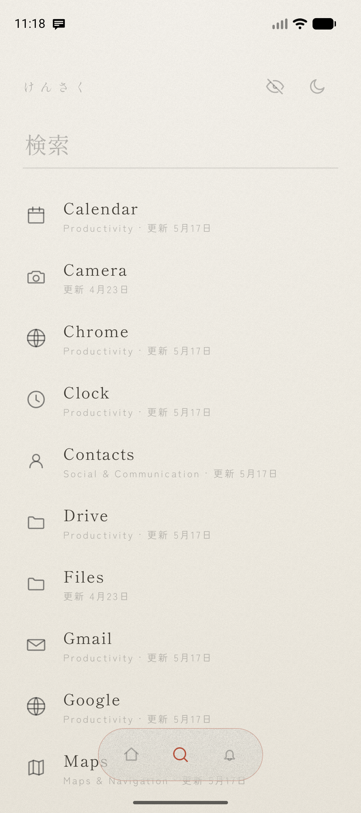
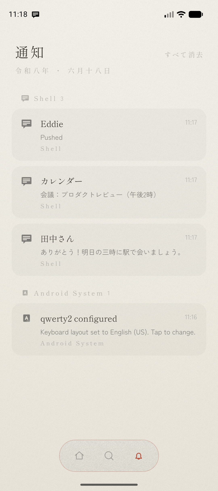

<div align="center">



# Tempo

**An ultra-minimal Android launcher: airy washi paper, Japanese typography, no distractions.**

[](LICENSE)
[](../../actions/workflows/android.yml)


### [⬇ Download the latest APK](https://github.com/eddiegulay/tempo/releases)

</div>

> **Why this exists**
>
> I doom-scroll. A lot. I went looking for a way out, and the best one I could come up with was to
> lock myself out, a launcher that blocks the apps for good. Not "hidden until I cave," not "back in
> a tap." For good. I mean it. And yes, the whole thing is in Japanese, a language I can't speak,
> because friction is the point.
>
> *eddiegulay*

Tempo is a home-screen replacement built around one idea: **peace, no distractions.** It tells the
time, finds an app, and shows your notifications on a calm, paper-cream canvas with a single
vermillion accent — and when you want to leave the launcher entirely, it has two full-screen modes
to leave it *for*: 集中 (a clock and nothing else) and 鍛錬 (a workout timer).

<div align="center">


&nbsp;&nbsp;

&nbsp;&nbsp;


<sub>Home (ホーム) &nbsp;·&nbsp; Search (検索) &nbsp;·&nbsp; Notifications (通知)</sub>

</div>

## Features

- **Home**: a faint sumi-e ensō behind a large mincho clock, the date in vertical Reiwa-era kanji
  (令和八年・六月十七日・水曜日), a live spoken-style reading (午後九時一分), and a single 静 ("stillness") seal.
  The corner is set vertically (縦書き) in Japanese and horizontally in English — stacking Latin
  letters one per line is a ransom note, not typography.
- **Search (検索)**: live-filtered list of every installed app (work-profile apps included), with a
  scale-up launch animation and a long-press menu (app info / hide / uninstall). The hidden-apps page,
  the theme toggle and the language picker live in this screen's header.
- **The blockade (the whole point)**: hide an app and it's gone for **10 days**, no take-backs. A
  confirmation spells out the commitment, a live countdown shows the time remaining, and while an app
  is blocked its **notifications are suppressed system-wide** too. The ledger is included in Android
  Auto Backup, so on most devices uninstalling and reinstalling Tempo *doesn't* reset the timer —
  best-effort, not tamper-proof, and it needs no permission at all.
- **Notifications (通知)**: your real notifications, tap to open, swipe to dismiss, ordered by the
  system ranking, minus anything from a blocked app.
- **Calendar (予定)**: your real agenda, read from the device calendar provider — the same place the
  Google Calendar app syncs into. The next event replaces the date in Home's corner, set vertically
  in Japanese. Add and edit events in place, on a 栞 wheel rather than a Material date picker. Every
  write asks first, because a calendar is not private state: what Tempo saves reaches your other
  devices and anyone invited.
- **集中 (Focus)**: a landscape clock and a Pomodoro, full-bleed, no dock, no system bars. The screen
  stays awake only while it is on screen.
- **鍛錬 (Training)**: a workout timer where **the ensō *is* the countdown** — the brushed circle
  closes as the interval runs out, which you can read from arm's length in a way you cannot read a
  two-digit number. Seven workout shapes (circuits, AMRAP, for-time, EMOM, fixed sets), nine built-in
  routines including the benchmark workouts people actually train, a routine builder, and records
  with personal bests and a training-load view. Nothing advances past a rep-based exercise on its
  own — you press 済 when you are done. A workout you cut short is recorded as what it was rather
  than discarded.
- **Japanese and English**: the app is Japanese by default and by design (see above). English is
  there because a first-launch screen that explains what Tempo is about to read — every notification
  on your phone — is not consent if you cannot read it. Choose on that first screen, or later from
  the Search header. Japanese is unchanged: every Japanese string is the one that shipped before.
- **Paper / Sumi themes**: a one-tap toggle between washi cream and warm charcoal, persisted.
- **Ink, not ripples**: everything you press settles into the shape of the control it belongs to, in
  the theme's own ink, and fades out more slowly than it comes in. Material's default draws a grey
  rectangle from a colour scheme this app never sets.
- **A well-behaved launcher**: HOME-press always returns to a clean home, a lifecycle-aware
  minute clock (no idle wakeups), default-home onboarding, edge-to-edge insets, predictive back, and
  accessible controls.

## Usage

Tempo has three main screens plus two full-screen modes, reached from the floating dock pill at the
bottom of every screen. There is no settings page, no widgets, no folders. That's the point — the
handful of choices there are (theme, language) live in the Search header.

- **Set it as your home app.** Press Home and pick **Tempo**, or long-press the dock pill (it glows
  vermillion until Tempo is your default) to jump to the system picker.
- **Home (ホーム)**: a minute-aligned mincho clock with a spoken-style kanji reading, the date in
  vertical Reiwa-era kanji, the faint ensō, and the 静 seal. Back and the Home button always return
  here.
- **Search (検索)**: type any part of an app's name or package
  to live-filter. Tap a row (or press **Go** to launch the top hit) to open it; long-press for
  **app info / hide / uninstall**. The header carries the hidden-apps button, the theme toggle and
  the language picker.
- **Block an app (the point).** Hide an app from the long-press menu or the hidden-apps page (the
  eye-off button in the Search header). You'll confirm a **10-day** commitment, and from then on the
  app is gone from Search and its notifications are suppressed. Tap it on the hidden-apps page to see
  the countdown; it can only be restored once the 10 days are up.
- **Notifications (通知)**: grant notification access once (tap **タップして許可**); then tap a row to
  open it or swipe either way to dismiss it.
- **Calendar (予定)**: tap Home's top-right corner. There is no dock tab for it, because a home
  screen should stay a home screen. Grant calendar access when asked; every add, edit and delete
  restates what it is about to do and waits to be told yes.
- **集中 / 鍛錬**: long-press the Home clock to choose a mode, or tap the dumbbell in the dock to go
  straight to 鍛錬. Both take the whole window; Back leaves them.
- **Theme**: tap the sun/moon icon in the **Search header** to toggle **Paper ⇄ Sumi**; your
  choice is saved.
- **Language**: tap the globe in the **Search header** and pick 日本語 or English. It is a picker
  rather than a toggle, and each option is written in its own language — guess wrong on a blind
  switch and you may not be able to read the control that would put it back.

**→ Full walkthrough, gesture reference, and FAQ: [`docs/USER_GUIDE.md`](docs/USER_GUIDE.md).**

## Tech stack

- **Kotlin** + **Jetpack Compose** (Material 3): the entire UI is Compose, drawn edge-to-edge.
- **MVVM**: a `LauncherViewModel` over the launcher's repositories (apps, theme, notifications,
  blockade, calendar), and a separate `GymViewModel` for 鍛錬 that constructs **nothing** until the
  feature is first opened — a home app's `onCreate` runs on every HOME press, and a user who never
  trains should never pay for a database they do not have.
- **Jetpack DataStore** for settings; **`LauncherApps`** for a live app inventory; a
  **`NotificationListenerService`** for real notifications (and for suppressing blocked apps').
- **The blockade ledger** lives in app-private storage and is included in **Android Auto Backup**, so
  a reinstall restores an active block before the app first runs. It carries a monotonic `lastSeen`
  high-water mark, and "now" is `max(systemClock, lastSeen)`, so winding the system clock back cannot
  shorten a block. This replaced an earlier shared-storage mirror that needed All-files access —
  a very broad permission to buy a best-effort guarantee that backup already provides. It is
  best-effort either way: a determined user can disable backup, and guaranteed enforcement would need
  Device Owner provisioning.
- **鍛錬's store is SQLite** through the platform `SQLiteOpenHelper` rather than Room, which would
  need KSP and a dependency. minSdk 29 pins SQLite 3.28, so every migration is additive and
  irreversible: no `STRICT`, no `RETURNING`, no `DROP COLUMN`.
- **Localisation is a Kotlin table, not `res/values-en`.** A third of the user-visible strings live
  in the domain layer, which has no `Context`, and reading a string resource in a unit test needs
  Robolectric. The table is an interface with one implementation per language, so **a missing
  translation is a compile error** — where Android resources fall back to the default language
  silently, which here would mean shipping Japanese to an English user. Numbers, dates and counters
  are a separate `Formats` layer, because `一分三十秒` is not a phrase, it is a function over 90.
- No DI framework, no third-party UI libraries, just AndroidX.

## Build & run

Requirements: **JDK 17+** and the **Android SDK** (compileSdk 36, minSdk 29 — Android 10 and up). CI
builds on JDK 21.

```bash
git clone https://github.com/eddiegulay/tempo.git
cd tempo
./gradlew assembleDebug          # build the debug APK
./gradlew installDebug           # build + install on a connected device/emulator
./gradlew testDebugUnitTest      # run unit tests

# the gate every change has to pass — this is what CI runs
./gradlew assembleDebug lintDebug testDebugUnitTest
```

The suite is ~1,500 plain JUnit tests and no instrumentation, which is deliberate: the copy, the
timeline arithmetic and the progression rules are all pure Kotlin so they can be checked on the JVM
in seconds. Several tests read the **source text** rather than calling into it — they pin facts a
compiler cannot, such as "no page holds a Japanese string literal outside the table", "no screen
draws the training-load ratio", and "`GymViewModel`'s `init` stays last in the class body".

Open the project in Android Studio (latest stable) and let it sync; `local.properties` is generated
for you and is intentionally git-ignored.

### Using it as your launcher

Once installed, press Home and pick **Tempo**. The first screen asks for the two accesses it needs —
the home-app role and notification access — and explains what each is for before asking; pick your
language there if Japanese is not one you read. App search needs no permission, and the calendar asks
only when you first open 予定. See the [Usage](#usage) section above or the full
[User Guide](docs/USER_GUIDE.md) for the complete walkthrough.

## Project layout

```
app/src/main/java/io/eddiegulay/tempo/
├─ MainActivity.kt              # HOME activity; owns the ViewModels + lifecycle
├─ LauncherViewModel.kt         # single source of launcher UI state
├─ data/                        # AppRepository, ThemeRepository (DataStore), BlockadeRepository, JapaneseDate
├─ notification/                # listener service (+ blocked-app suppression), store, repository
├─ calendar/                    # provider access, models, write outcomes
├─ i18n/                        # the string table: one file per namespace, plus Formats
├─ gym/                         # 鍛錬's domain: models, timeline, cues, progression
│  ├─ data/                     # SQLite schema, store, migrations, the seeded catalogue
│  ├─ session/                  # timeline compiler, session machine, reconciliation
│  └─ cue/                      # speech, tones, haptics, and the disarm matrix
└─ ui/                          # Compose screens, Dock, dialogs, theme
   ├─ gym/                      # 鍛錬's pages
   │  └─ session/               # the live player
   └─ theme/                    # palette, type, shapes, the ink press indication
```

## Contributing

Contributions are welcome. Please read [`CONTRIBUTING.md`](CONTRIBUTING.md) and the
[Code of Conduct](CODE_OF_CONDUCT.md). Bug reports and feature requests go through the
[issue templates](.github/ISSUE_TEMPLATE).

## Credits

- The app logo is the kanji **拍** ("beat", a single-character reading of *tempo*) set in Hiragino
  Mincho, in the same vermillion as the home seal. The master asset is
  [`art/logo/tempo_logo.svg`](art/logo/tempo_logo.svg); the Android adaptive icon (vector foreground
  + washi gradient background + themed monochrome layer) is generated from the same glyph outline.
- The cover art ([`art/cover/tempo_cover.svg`](art/cover/tempo_cover.svg)) sets the same 拍 glyph inside a
  hand-drawn sumi-e ensō on the washi ground, with the 静 seal — the app's palette and type, composed
  around the negative space (*ma*) the launcher is built on.
- The visual direction was prototyped in **Claude Design** and implemented natively here.
- Display fonts: **Shippori Mincho** (clock, date, app names, 静 seal) and **Zen Kaku Gothic New**
  (notification copy, romaji), from Google Fonts under the SIL Open Font License, bundled under
  `app/src/main/res/font` so the design renders with its intended type rather than the platform
  Noto CJK fallback.

## License

[MIT](LICENSE) © 2026 Eddie Gulay
